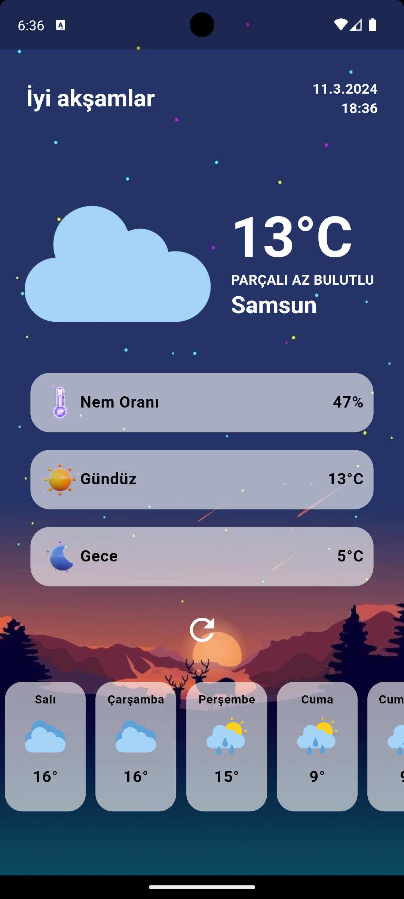
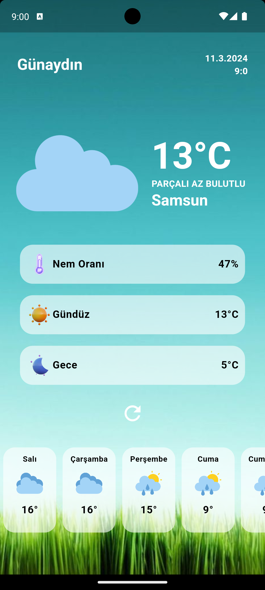

# weatherapp

Bu Flutter uygulaması, gerçek zamanlı hava durumu bilgilerini görsel bir arayüzle kullanıcılara sunar.

## Ekran Görüntüleri

    
     

## Özellikler

- **Anasayfa**: Güncel hava durumu bilgileri ve selamlama mesajı.
- **Haftalık Tahminler**: Haftalık hava durumu tahminleri kartlar halinde görüntülenir.
- **Detaylı Bilgiler**: Günlük hava durumu bilgileri, nem oranı, gündüz ve gece sıcaklıkları.
- **Görsel İkonlar**: Hava durumu durumlarına uygun ikonlar kullanılır.

Kullanılan Teknolojiler =>

Flutter: UI geliştirmek için kullanılan çerçeve.
Bloc Pattern: State yönetimi için kullanılan Bloc kütüphanesi.
Collect API: Hava durumu verilerini almak için kullanılan API.